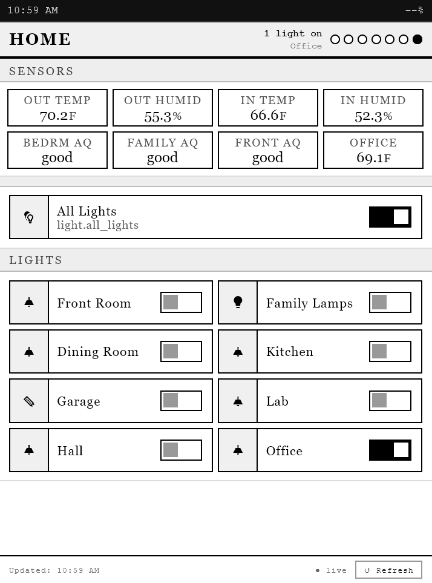

# Kindle Dashboard

A Home Assistant custom integration that serves a clean, e-ink–optimised dashboard for jailbroken Kindles, with a full configuration UI accessible from the HA sidebar. Supports multiple independent dashboards, each with its own URL, layout, and settings.

## Features

- **Multiple dashboards** — add as many dashboards as you like, each independently configured
- **Kindle-optimised view** — high-contrast, large touch targets for controls, compact layout for read-only sensors
- **Four themes** — Sharp (default), Soft, Ink, and Minimal
- **Flexible sections** — add, remove, and reorder sections; each section is one of:
  - **Sensors** — compact read-only tiles, configurable label and unit; auto-layout up to 4 columns
  - **Toggles** — large-tap-target rows for lights, switches, fans, covers, locks, etc.
  - **Scenes** — tappable scene buttons
  - Toggles and Scenes support an optional 2-column layout; all section types support hiding entity IDs
- **Font picker** — choose from Georgia, Courier New, Times New Roman, Arial, Helvetica, Verdana, Palatino, or Bookman
- **Per-tier text styling** — independent bold, italic, underline, and size controls for labels, ID/unit text, and sensor values
- **Inline or stacked units** — show sensor units on the same line as the value (`22 °F`) or on the line below
- **Light status strip** — dots + count summary of all lights; individual lights can be excluded per-section
- **Battery and time bar** — shows Kindle battery level and current time at the top of the page (requires shortcut browser setup below)
- **Configurable auto-refresh interval** — set how often entity states are pulled (default 60 seconds)
- **Force Refresh** — reload the Kindle page remotely from the HA panel top bar, within 5 seconds
- **Hard Refresh mode** — make the on-screen ↺ button do a full page reload instead of just pulling new values
- **Config backup** — export and import dashboard configuration as JSON
- **Token auth** — long-lived access token embedded in the bookmark URL; no session cookie needed

---

## Screenshot



*Sharp theme · Georgia font · Sensors, Toggles (single and 2-column), running on a Kindle Paperwhite 10th Generation*

---

## Installation via HACS

1. In HACS → ⋮ → **Custom Repositories** → paste your GitHub repo URL → category: **Integration**
2. Click **Add**, search for **Kindle Dashboard**, and install
3. Restart Home Assistant

## Manual Installation

Copy `custom_components/kindle_dashboard/` into your HA config's `custom_components/` folder and restart.

---

## Setup

1. **Settings → Devices & Services → Add Integration** → search **Kindle Dashboard**
2. Enter a **Dashboard Name** (e.g. `Main`) and optional **Location Name** (e.g. `Home`)
3. **Kindle Dashboard** appears in the HA sidebar
4. Repeat to add additional dashboards — each gets its own unique URL

---

## Configuring the Dashboard

Open **Kindle Dashboard** in the sidebar. Use the **dashboard picker** in the top bar to switch between dashboards. The top bar also has a **↺ Force Refresh** button and a **Preview ↗** link that opens the Kindle page in a new tab.

The config panel has five cards:

### Kindle URL
Paste a Long-Lived Access Token (from your HA profile → Long-Lived Access Tokens) and save. The bookmark URL for your Kindle is generated automatically. Use the **⎘ Copy** button to copy it, or click **Preview ↗** in the top bar to open it.

### Configuration Backup
Export your dashboard configuration to a JSON file, or import a previously saved one. Importing loads the config into the editor — review it and hit Save to apply. Useful for backing up before making large changes, or copying a config to a new dashboard.

### General
- **Dashboard Name** — the name shown in the dashboard picker and the HA integrations list
- **Location Name** — displayed in the info bar on the Kindle page
- **Theme** — Sharp, Soft, Ink, or Minimal
- **Font** — body font for the Kindle page
- **Auto-Refresh Interval** — how often entity states are pulled (10–3600 seconds, default 60)
- **Hard Refresh** — when enabled, the ↺ button on the Kindle reloads the entire page (re-fetches HTML, config, and assets) instead of only updating entity states. Use when changes are not appearing after a config save.
- **Show clock in top bar** — displays the current time in the black bar at the very top of the Kindle page
- **Show battery in top bar** — displays the Kindle battery percentage (requires shortcut browser HTTP server setup — see below)

### Page Dimensions & Text Styling

**Page Dimensions** (left column):
- **Width / Height** — set to match your Kindle's screen resolution
- **Scale** — multiplies all content proportionally; use above 1.0 for high-DPI screens

**Example — Kindle Paperwhite 10th Generation:**
| Setting | Value |
|---|---|
| Page Width | 536 px |
| Page Height | 722 px |
| Scale | 1.0× |

**Text Styling** (right column):
- **Label / ID+Unit / Value** — independent font size (px) with Bold, Italic, and Underline toggles for each tier

### Sections
Each section card shows its type, a name field, and its items. Use ↑ ↓ to reorder, 🗑 to remove.

To add a section: pick a type from the dropdown at the bottom and click **+ Add Section**.

**Section types and options:**

| Type | Per-section options | Item fields |
|---|---|---|
| Sensors | Inline Units, Hide IDs | Entity, Label, Unit |
| Toggles | 2 Columns, Hide IDs | Icon, Entity, Label, Hide from status |
| Scenes | 2 Columns, Hide IDs | Icon, Entity, Name |

Sensors automatically lay out in up to 4 columns. **2 Columns** arranges Toggles or Scenes in a two-column grid. **Hide IDs** suppresses the entity ID shown below each label. **Inline Units** shows sensor units on the same line as the value.

Click **Save** (floating button, bottom-right) when done. Use **↺ Force Refresh** in the top bar to push changes to the Kindle immediately.

---

## On Your Kindle (must be jailbroken)

1. Install [kindle-shortcut-browser](https://github.com/mitchellurgero/kindle-shortcut-browser)
2. In `shortcut_browser.sh`, update the config section:
```sh
GO_FULLSCREEN=true
FULLSCREEN_SITE="http://<your-ha-ip>:8123/api/kindle_dashboard/kindle/<entry_id>?token=YOUR_TOKEN&device=bedroom-kindle"
EXTRACHROMEARGS="--kiosk"
```
> The full URL including `<entry_id>` is shown in the **Kindle URL** card in the panel.
>
> The `device=` parameter is optional but **required for per-device battery tracking** when multiple Kindles share a dashboard. Set it to any short identifier with no spaces (e.g. `bedroom-kindle`, `kitchen`). Each device will create its own sensor entity in HA (`sensor.home_battery_bedroom_kindle`) and appear individually in the panel top bar. If omitted, all devices write to the same `sensor.home_battery` entity.

3. Add the following to `shortcut_browser.sh` to enable the battery display and prevent sleep:
```sh
## Kindle Dashboard — battery, sleep prevention, and HTTP server ##
BAT_FILE="/mnt/us/kbbat"

# ── Battery ───────────────────────────────────────────────────────────────
BAT=$(lipc-get-prop com.lab126.powerd battLevel 2>/dev/null | tr -d '[] ')
[ -z "$BAT" ] && BAT=$(cat /sys/class/power_supply/*/capacity 2>/dev/null | head -1)
[ -z "$BAT" ] && BAT="?"
printf '%s' "$BAT" > "$BAT_FILE"

( while true; do
    B=$(lipc-get-prop com.lab126.powerd battLevel 2>/dev/null | tr -d '[] ')
    [ -z "$B" ] && B=$(cat /sys/class/power_supply/*/capacity 2>/dev/null | head -1)
    [ -z "$B" ] && B="?"
    printf '%s' "$B" > "$BAT_FILE"
    sleep 30
  done ) &
BAT_PID=$!

# ── Prevent sleep while dashboard is running ─────────────────────────────
lipc-set-prop -i com.lab126.powerd preventScreenSaver 1

# ── Cleanup on exit: restore sleep and kill background jobs ──────────────
trap 'lipc-set-prop -i com.lab126.powerd preventScreenSaver 0; \
      kill $BAT_PID $BAT_HTTP_PID 2>/dev/null' \
     EXIT INT TERM

# ── HTTP server on port 2024: serves battery value to the dashboard ───────
BAT_PORT=2024
( while true; do
    VAL=$(cat "$BAT_FILE" 2>/dev/null || echo "?")
    BODY="${VAL}"
    RESP="HTTP/1.0 200 OK\r\nContent-Type: text/plain\r\nAccess-Control-Allow-Origin: *\r\nContent-Length: ${#BODY}\r\nConnection: close\r\n\r\n${BODY}"
    echo -e "$RESP" | nc -l -p $BAT_PORT
  done ) &
BAT_HTTP_PID=$!
## End Kindle Dashboard additions ##
```
4. Eject the Kindle and launch the Shortcut Browser. It will take a few seconds to launch and then should show the dashboard.

---

## Refresh Behaviour

| Method | What it does |
|---|---|
| Auto-refresh (configurable, default 60s) | Pulls fresh entity states; no page reload |
| ↺ button (normal mode) | Same as auto-refresh, on demand |
| ↺ button (Hard Refresh enabled) | Full page reload — re-fetches HTML, config, and assets |
| ↺ Force Refresh (panel top bar) | Triggers a full page reload on the Kindle within 5 seconds, from your computer |

---

## File Structure

```
kindle_dashboard/
├── hacs.json
├── README.md
├── example_screenshot.png
└── custom_components/kindle_dashboard/
    ├── __init__.py          # Integration setup, HTTP views, multi-dashboard support
    ├── config_flow.py       # Setup wizard (supports multiple instances)
    ├── const.py             # Constants and defaults
    ├── manifest.json
    ├── strings.json + translations/en.json
    ├── websocket_api.py     # WebSocket API (get_dashboards, get/save config, force refresh)
    └── frontend/
        ├── panel.js         # HA sidebar config panel (web component)
        ├── kindle.html      # Kindle page template
        └── mdi-kindle.woff  # Subsetted Material Design Icons font (588 icons)
```
